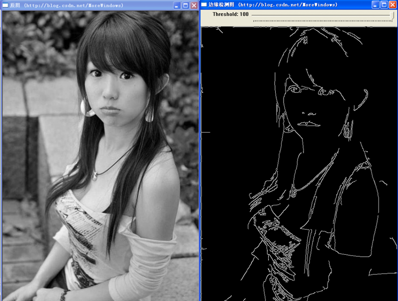
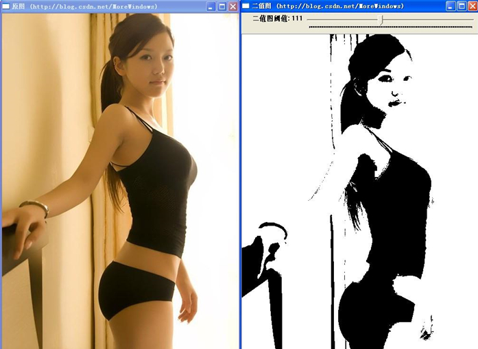

# OpenCV入门指南

OpenCV 移植自 C++，故这里以C++讲解。

- Canny边缘检测
- 图像的二值化

## Canny边缘检测

图像的边缘检测的原理是检测出图像中所有灰度值变化较大的点，而且这些点连接起来就构成了若干线条，这些线条就可以称为图像的边缘。

Canny边缘检测算子是John F. Canny于 1986 年开发出来的一个多级边缘检测算法。Canny 边缘检测的数学原理和算法实现这里就不再了，有兴趣的读者可以查阅专业书籍，本文主要介绍如何在OpenCV中对图像进行Canny 边缘检测，下面就来看看这个函数的原型。
    
### 一、主要函数 

##### 1.1 cvCanny

函数功能：采用Canny方法对图像进行边缘检测

函数原型：

```c++
void cvCanny(
  const CvArr* image,
  CvArr* edges,
  double threshold1,double threshold2,
  int aperture_size=3,
  boolean L2_gradient
);
```

函数说明：

- image 输入单通道图像（可以是彩色图像）对于多通道的图像可以用cvCvtColor()修改；
    使用`cvCvtColor()`：将彩色图像转换为灰度图像。
- edges 输出的边缘图像，也是单通道的，但是是黑白的；
- 第三个参数和第四个参数表示阈值，这二个阈值当中：
    小的阈值用来控制边缘连接；
    大的阈值用来控制强边缘的初始分割，即如果一个像素的梯度大于上限值，则被认为是边缘像素，如果小于下限阈值，则被抛弃。
        如果该点的梯度在两者之间则当这个点与高于上限值的像素点连接时我们才保留，否则删除。
- 可选参数aperture_Size表示Sobel算子大小，默认为3即表示一个3*3的矩阵。Sobel 算子与高斯拉普拉斯算子都是常用的边缘算子，详细的数学原理可以查阅专业书籍。
- 可选参数`L2_gradient`是一个布尔值，
    如果为真，则使用更精确的L2范数进行计算，否则使用L1范数
    
为了更好的使用`cvCanny()`函数，下面再介绍二个实用的函数，这二个函数对后面的程序实现非常有帮助。

##### 1.2 cvCreateTrackbar

函数功能：创建trackbar并添加到指定窗口

函数原型：

```c++
intcvCreateTrackbar(
  const char* trackbar_name,
  const char* window_name,
  int* value,
  int count,
  CvTrackbarCallback on_change
);
```

函数说明：

- 第一个参数表示该trackbar的名称。
- 第二个参数表示窗口名称，该trackbar将显示在这个窗口内。
- 第三个参数表示创建时滑块的位置。
- 第四个参数表示滑块位置的最大值，最小值固定为0。
- 第五个参数表示回调函数。当滑块位置有变化时，系统会调用该回调函数。

注：被创建的trackbar默认显示在指定窗口的顶端，可以通过函数cvGetTrackbarPos()来获取trackbar显示的位置信息，以及通过函数cvSetTrackbarPos()来重新设置trackbar的显示位置。

##### 1.3、CvTrackbarCallback

函数功能：cvCreateTrackbar()函数所使用的回调函数

函数定义：

```c++
typedef void (CV_CDECL *CvTrackbarCallback)(int pos)
```

函数说明：

当trackbar位置被改变的时，系统会调用这个回调函数，并将参数pos设置为表示trackbar位置的数值。

## 二、示例程序代码

下面就给出在OpenCV中使用Canny边缘检测的程序代码：

```c++
//图像的Canny边缘检测
#include <opencv2/opencv.hpp>
using namespace std;
#pragma comment(linker, "/subsystem:\"windows\" /entry:\"mainCRTStartup\"")
IplImage *g_pSrcImage, *g_pCannyImg;
const char *pstrWindowsCannyTitle = "边缘检测图(http://blog.csdn.net/MoreWindows)";
//cvCreateTrackbar的回调函数
void on_trackbar(int threshold)
{
	//canny边缘检测
	cvCanny(g_pSrcImage, g_pCannyImg, threshold, threshold * 3, 3);
	cvShowImage(pstrWindowsCannyTitle, g_pCannyImg);
}
int main()
{
	const char *pstrImageName = "001.jpg";
	const char *pstrWindowsSrcTitle = "原图(http://blog.csdn.net/MoreWindows)";
	const char *pstrWindowsToolBar = "Threshold";

	//从文件中载入图像的灰度图CV_LOAD_IMAGE_GRAYSCALE - 灰度图
	g_pSrcImage = cvLoadImage(pstrImageName, CV_LOAD_IMAGE_GRAYSCALE);
	g_pCannyImg = cvCreateImage(cvGetSize(g_pSrcImage), IPL_DEPTH_8U, 1);

	//创建窗口
	cvNamedWindow(pstrWindowsSrcTitle, CV_WINDOW_AUTOSIZE);
	cvNamedWindow(pstrWindowsCannyTitle, CV_WINDOW_AUTOSIZE);

//创建滑动条
	int nThresholdEdge = 1;
	cvCreateTrackbar(pstrWindowsToolBar, pstrWindowsCannyTitle, &nThresholdEdge, 100, on_trackbar);

	//在指定窗口中显示图像
	cvShowImage(pstrWindowsSrcTitle, g_pSrcImage);
	on_trackbar(1);

	//等待按键事件
	cvWaitKey();

	cvDestroyWindow(pstrWindowsSrcTitle);
	cvDestroyWindow(pstrWindowsCannyTitle);
	cvReleaseImage(&g_pSrcImage);
	cvReleaseImage(&g_pCannyImg);
	return 0;
}
```

运行效果如图所示：



本篇介绍了Canny边缘检测，这种方法能有效的找出图像中的所有边缘。后面将还有文章介绍在OpenCV中对图像进行轮廓检测。

在对图像进行轮廓检测前必须要先对图像进行二值化。

---

## 图像的二值化

在上一篇《【OpenCV入门指南】Canny边缘检测》中介绍了使用Canny算子对图像进行边缘检测。
与边缘检测相比，轮廓检测有时能更好的反映图像的内容。而要对图像进行轮廓检测，则必须要先对图像进行二值化，
图像的二值化就是将图像上的像素点的灰度值设置为0或255，这样将使整个图像呈现出明显的黑白效果。
在数字图像处理中，二值图像占有非常重要的地位，图像的二值化使图像中数据量大为减少，从而能凸显出目标的轮廓。

### 一、关键函数介绍

下面就介绍OpenCV中对图像进行二值化的关键函数 —— `cvThreshold()`。

`cvThreshold`是opencv库中的一个函数。

作用：函数 `cvThreshold` 对**单通道数组**应用固定阈值操作。
该函数的典型应用是对灰度图像进行阈值操作得到二值图像。或者是去掉噪声，例如过滤很小或很大像素值的图像点。
本函数支持的对图像取阈值的方法由 `threshold_type` 确定。

使用`cvThreshold()`;将**灰度图像**转换为**二值图像**（该函数**只适用于单通道图像**）

函数功能：对图像进行二值化

函数原型：

```c++
void cvThreshold(
  const CvArr* src,
  CvArr* dst,
  double threshold,
  double max_value,
  int threshold_type
); 
```

函数说明：

- src：原始数组 (单通道)
- dst：输出数组
- 第三个参数表示阈值
- 第四个参数表示最大值。
- 第五个参数表示运算方法。

在OpenCV的imgproc\types_c.h中可以找到运算方法的定义。

```c++
/* Threshold types */
enum
{
    CV_THRESH_BINARY      =0,  /* value = value > threshold ? max_value : 0       */
    CV_THRESH_BINARY_INV  =1,  /* value = value > threshold ? 0 : max_value       */
    CV_THRESH_TRUNC       =2,  /* value = value > threshold ? threshold : value   */
    CV_THRESH_TOZERO      =3,  /* value = value > threshold ? value : 0           */
    CV_THRESH_TOZERO_INV  =4,  /* value = value > threshold ? 0 : value           */
    CV_THRESH_MASK        =7,
    CV_THRESH_OTSU        =8  /* use Otsu algorithm to choose the optimal threshold value; combine the flag with one of the above CV_THRESH_* values */
};
```

注释已经写的很清楚了，因此不再用中文来表达了

### 二、示例程序代码

下面给出对图像进行二值化的完整的源代码：

```c++
//图像的二值化
#include <opencv2/opencv.hpp>
using namespace std;

#pragma comment(linker, "/subsystem:\"windows\" /entry:\"mainCRTStartup\"")

IplImage *g_pGrayImage = NULL;
IplImage *g_pBinaryImage = NULL;
const char *pstrWindowsBinaryTitle = "二值图(http://blog.csdn.net/MoreWindows)";

void on_trackbar(int pos)
{
	// 转为二值图
	cvThreshold(g_pGrayImage, g_pBinaryImage, pos, 255, CV_THRESH_BINARY);
	// 显示二值图
	cvShowImage(pstrWindowsBinaryTitle, g_pBinaryImage);
}

int main( int argc, char** argv )
{	
	const char *pstrWindowsSrcTitle = "原图(http://blog.csdn.net/MoreWindows)";
	const char *pstrWindowsToolBarName = "二值图阈值";

	// 从文件中加载原图
	IplImage *pSrcImage = cvLoadImage("002.jpg", CV_LOAD_IMAGE_UNCHANGED);

	// 转为灰度图
	g_pGrayImage =  cvCreateImage(cvGetSize(pSrcImage), IPL_DEPTH_8U, 1);
	cvCvtColor(pSrcImage, g_pGrayImage, CV_BGR2GRAY);

	// 创建二值图
	g_pBinaryImage = cvCreateImage(cvGetSize(g_pGrayImage), IPL_DEPTH_8U, 1);

	// 显示原图
	cvNamedWindow(pstrWindowsSrcTitle, CV_WINDOW_AUTOSIZE);
	cvShowImage(pstrWindowsSrcTitle, pSrcImage);
	// 创建二值图窗口
	cvNamedWindow(pstrWindowsBinaryTitle, CV_WINDOW_AUTOSIZE);

	// 滑动条	
	int nThreshold = 0;
	cvCreateTrackbar(pstrWindowsToolBarName, pstrWindowsBinaryTitle, &nThreshold, 254, on_trackbar);

	on_trackbar(1);

	cvWaitKey(0);

	cvDestroyWindow(pstrWindowsSrcTitle);
	cvDestroyWindow(pstrWindowsBinaryTitle);
	cvReleaseImage(&pSrcImage);
	cvReleaseImage(&g_pGrayImage);
	cvReleaseImage(&g_pBinaryImage);
	return 0;
}
```

运行结果如下所示，自己动手调试下阈值大小，看看生成的二值图有什么变化。



OpenCV还有个`cvAdaptiveThreshold()`函数，这个函数会使用`Otsu`算法(大律法或最大类间方差法)（注1）来计算出一个全局阈值，然后根据这个阈值进行二值化。

当然直接使用上一篇《【OpenCV入门指南】Canny边缘检测》中的`cvCanny()`函数也可以对图像进行二值化（想到怎么传参数了吗？）。

注1．调用`cvThreshold()`时传入参数`CV_THRESH_OTSU`也是使用`Otsu`算法来自动生成一个阈值。