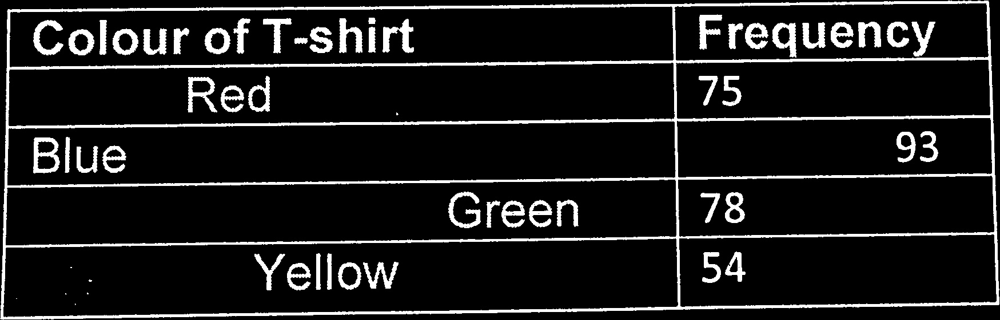
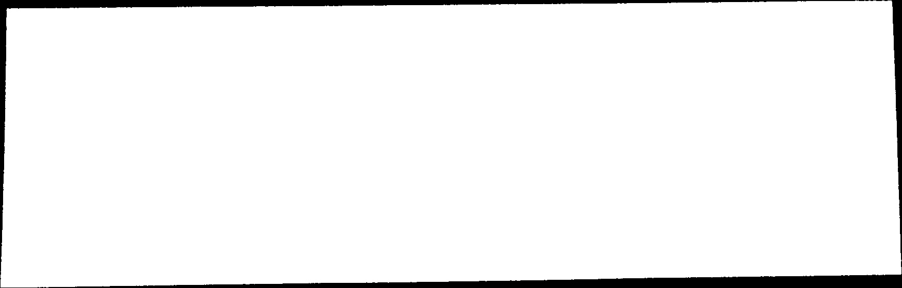
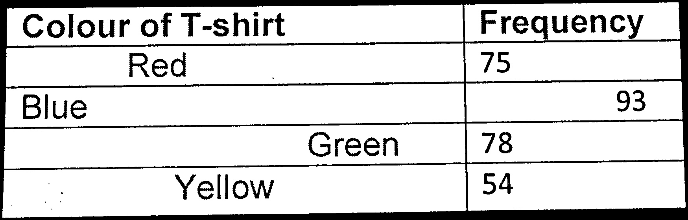
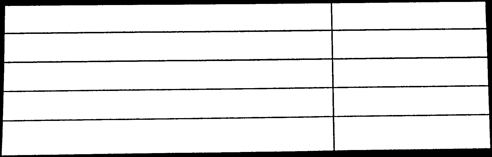
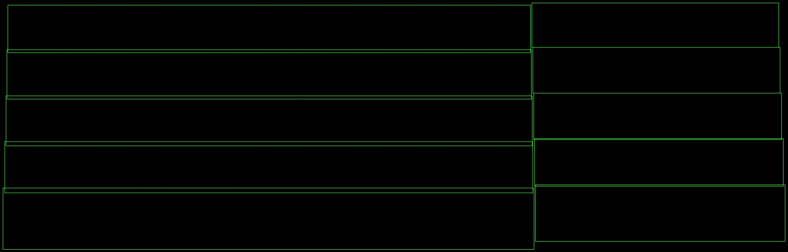
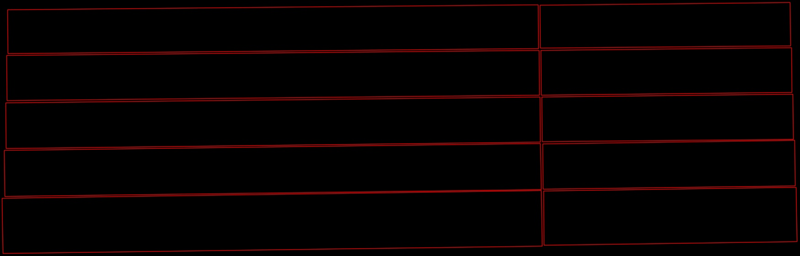

## 前言

相关OpenCV API，请查看[OpenCV.md](https://github.com/fnpac/pdf-table-analysis/tree/master/src/main/java/com/fnpac/pdf/table/analysis/opencv/OpenCV.md)

## 算法

1. 图像二值化（[Binary invert threshold](http://docs.opencv.org/doc/tutorials/imgproc/threshold/threshold.html#threshold-binary-inverted)）

    

2. 查找轮廓([Find contour](http://docs.opencv.org/doc/tutorials/imgproc/shapedescriptors/find_contours/find_contours.html))
    
    这里应该使用`RETR_EXTERNAL`，只提取最外层的轮廓
    
3. 然后用`CV_FILLED`(填充轮廓内部)绘制轮廓，这里你将得到你的表格的蒙版(mask)。
   
   请注意，这里，您应该只得到一个轮廓，并假定在表格外不会有任何噪点。或者如果您有多个轮廓，绘制最大的作为掩模。
   
   

4. threshold和mask之间的按位异或（[Bitwise xor](http://docs.opencv.org/modules/core/doc/operations_on_arrays.html#bitwise-xor)）

    
    
5. 再次查找轮廓，使用`RETR_EXTERNAL`选项。 使用`CV_FILLED`选项绘制轮廓。
    
    
    
6. 计算轮廓的边界矩形（[bounding Rect](http://docs.opencv.org/doc/tutorials/imgproc/shapedescriptors/bounding_rects_circles/bounding_rects_circles.html)）或旋转矩形（[Rotated rect](http://docs.opencv.org/doc/tutorials/imgproc/shapedescriptors/bounding_rotated_ellipses/bounding_rotated_ellipses.html)）以供进一步使用
    
    bounding Rect:
    
   
    Rotated rect:
     
    